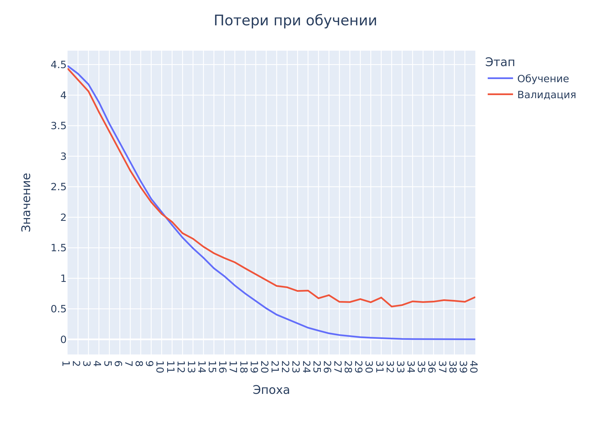
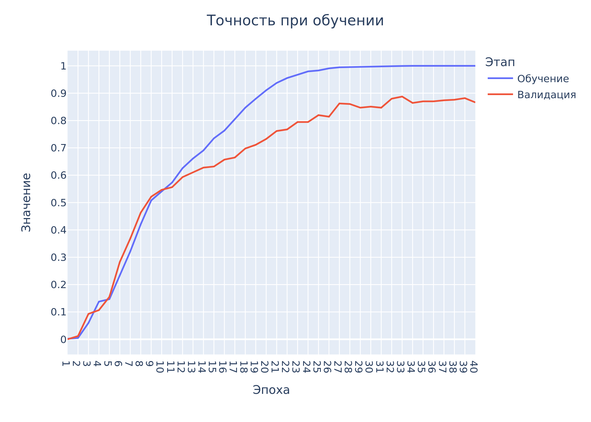
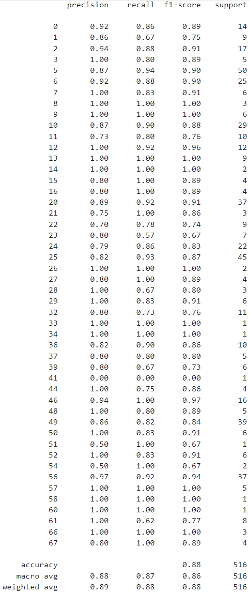

# GRNTIClassifier

[Портфолио](https://jellywilliam.github.io)

[Ссылка на репозиторий](https://github.com/JellyWilliam/GRNTIClassifier)

# Набор данных

Датасет был сгенерирован с помощью технологий веб-скрапинга и представляет собой набор из аннотаций к научным статьям и
их рубрикам по [ГРНТИ](https://grnti.ru/)

# Модель

Прежде всего были испытаны методы машинного обучения ([Scikit-learn models](Scikit-learn%20models)) и проверки их
возможностей для решения данной задачи, но в связи с неудовлетворительными результатами было принято использовать
нейросетевые технологии

Был проведен Fine Tuning модели [BERT](https://github.com/google-research/bert) для возможности классификации статей.

```python
def build_classifier_model(num_class: int):
    """
    Функция создания архитектуры модели

    :param num_class: количество выходных классов
    """
    # Слой входа
    text_input = tf.keras.layers.Input(shape=(), dtype=tf.string, name='text')
    # Слой препроцессинга для BERT
    preprocessing_layer = hub.KerasLayer("https://tfhub.dev/tensorflow/bert_multi_cased_preprocess/3",
                                         name='preprocessing')
    # Препроцессинг
    encoder_inputs = preprocessing_layer(text_input)
    # Слой модели BERT
    encoder = hub.KerasLayer("https://tfhub.dev/tensorflow/bert_multi_cased_L-12_H-768_A-12/4", trainable=True,
                             name='BERT')
    # Выход BERT
    outputs = encoder(encoder_inputs)
    # Собственные слои для классификации
    net = outputs['pooled_output']
    net = tf.keras.layers.Dropout(0.1)(net)
    net = tf.keras.layers.Dense(num_class, activation="softmax", name='classifier')(net)
    return tf.keras.Model(text_input, net)
```

## Обучение

Был проведен перевод статей с русского языка на английский, немецкий, испанский, французский

В ноутбуке [Обучение модели.ipynb](Tensorflow%20models/Обучение%20модели.ipynb) реализованы все этапы обучения модели.

Ниже представлены графики изменения потерь и точности при обучении на 40 эпохах





Метрики работы модели на тестовых данных:



**Итог:** модель, как и ожидалось, очень хорошо показала себя в мультиязычности, кроме того, не смотря на малый набор
данных при таком количестве классов, смогла достичь хороших результатов (86% F-мера)

## Веса модели

Вы можете загрузить веса **_BERT_** по
данной [ссылке](https://drive.google.com/file/d/1mSQY_gOq3WoPDTvAcmT4deis5yN1tqui/view?usp=sharing)
